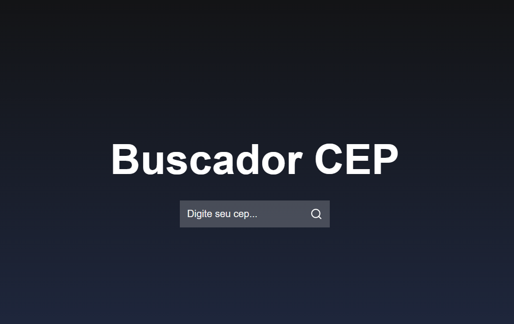
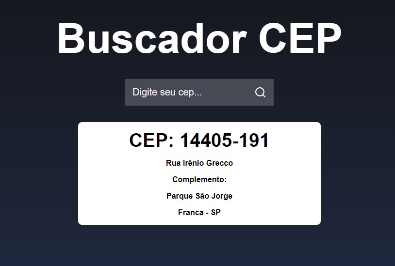
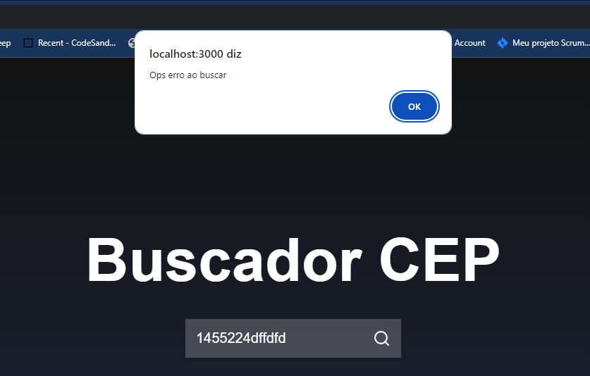
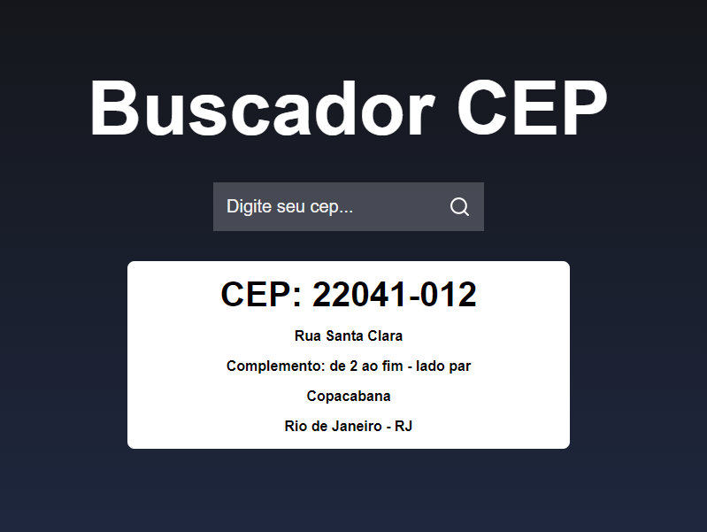
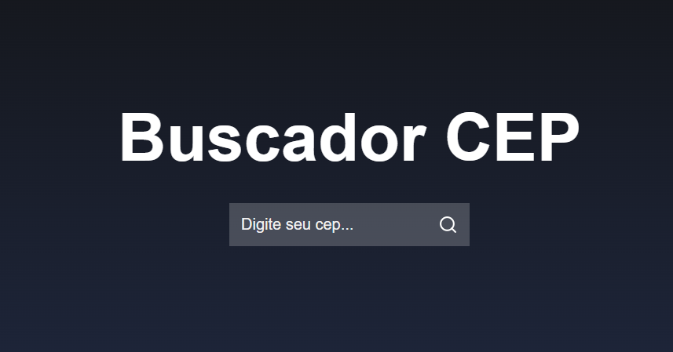

# Buscador

## Descrição

O Buscador é uma aplicação desenvolvida em React que permite aos usuários buscar informações de CEPs.

## Tecnologias Utilizadas

- React
- React DOM
- React Icons
- Axios
- Web Vitals
- Testing Library

## Instalação

1. Clone este repositório:

    ```
    git clone https://github.com/BrunoAlgarte/projeto_front_api
    ```

2. Instale as tecnologias utilizadas:

    - React e React DOM:

      ```
      npm install react react-dom
      ```

    - React Icons:

      ```
      npm install react-icons
      ```

    - Axios:

      ```
      npm install axios
      ```

    - Web Vitals:

      ```
      npm install web-vitals
      ```

    - Testing Library:

      ```
      npm install @testing-library/jest-dom @testing-library/react @testing-library/user-event
      ```

## Uso

Para iniciar a aplicação, você pode usar o seguinte comando:

 npm start


Isso iniciará um servidor de desenvolvimento local e abrirá automaticamente uma janela do navegador com a aplicação em execução.

## Aplicação











## Link da aplicação online

[Buscador de CEP](https://main--genuine-cuchufli-140969.netlify.app/)
